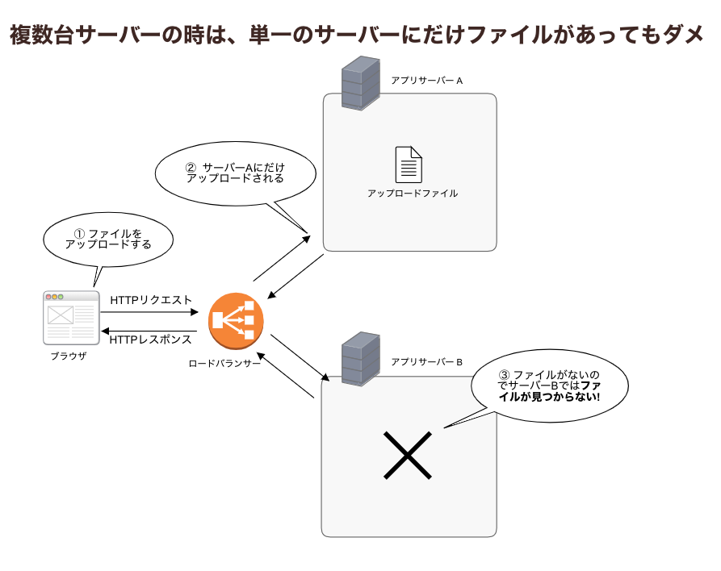
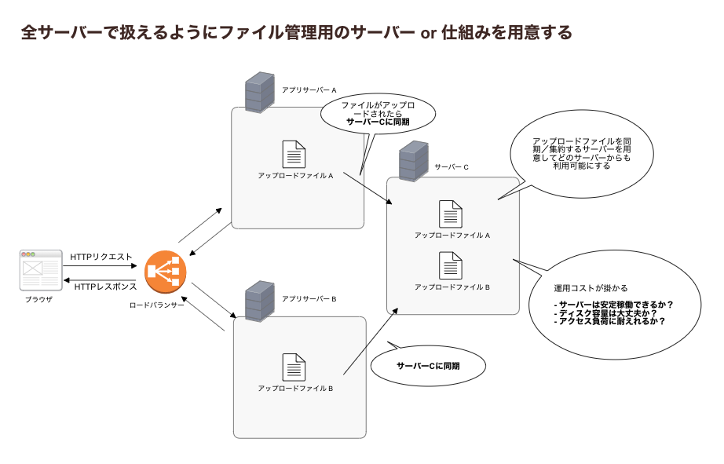

=============================
88:共有ストレージを用意しよう
=============================

サーバーが複数台あったとき、アップロードしたファイルなどの共有データを、どこに置いてどう管理したら良いか悩んだことはありませんか？　
単一サーバーでは問題にならなかった、複数サーバー間でのファイル共有について考えてみましょう。

具体的な失敗
==================

たとえば複数台のサーバーがあるようなWebアプリケーションを作ったとき、
以下の図のように単一のサーバーにだけファイルを保存していると、他のサーバーから利用できません。

   複数台サーバーのときは、単一のサーバーにだけファイルがあってもダメ

またサーバーが故障した場合などに、ファイルが消えてしまうリスクもあります。

ベストプラクティス
====================

アップロードファイルを集約して管理する、共有ストレージとなるようなサーバーを用意しましょう。
専用のサーバーが用意できない場合は ``NFS`` 等を利用してファイルを共有もします。

   全サーバーで扱えるようにファイル管理用のサーバーか、仕組みを用意する

上記のような自分たちでストレージを管理する場合、サーバーの運用コストはそれなりにかかります。

.. omission::

