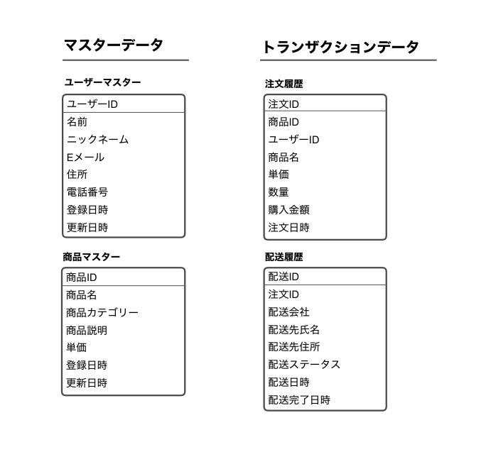

===================================================
46:マスターデータとトランザクションデータを分けよう
===================================================

.. index:: RDB

:index:`RDB` （Relational DataBase）についての知識をひととおり学び、現実世界のデータを元にデータ設計をしようとしたときに、どこから手をつけて良いのかわからないと思ったことはありませんか？　

ここではデータの種類と利用目的に応じてテーブルを分類する方法について説明します。

ベストプラクティス
========================

実世界のデータの塊をRDBで扱う場合、マスターデータとトランザクションデータの2種類に大別して考えるとデータ設計がスムーズに進みます。
この2種類を区別して考えないと無駄に多くデータを増やしてしまったり、 :doc:`47-トランザクションデータは正確に記録しよう` で紹介する
失敗のように、過去のデータが意図せずに復元できなくなります。

マスターデータとは、データの中でも基礎となるもので、商品情報や従業員情報など1つひとつの基礎的な情報を記録します。
たとえば、商品マスターであれば、商品名、型番、仕様など個々の商品の情報を扱います。

一方でトランザクションデータとは、システム上で発生した取引などの出来事を記録したデータのことで、
一般に履歴と呼ばれるものを指します。たとえば、商品の購買履歴や、従業員への給与支払い履歴などです。
イメージしやすいように図で考えてみましょう。

  マスターデータとトランザクションデータの例

マスターデータとトランザクションデータのイメージはなんとなくできたと思いますが、実際に何を基準として分類していけば良いでしょうか。

.. omission::
