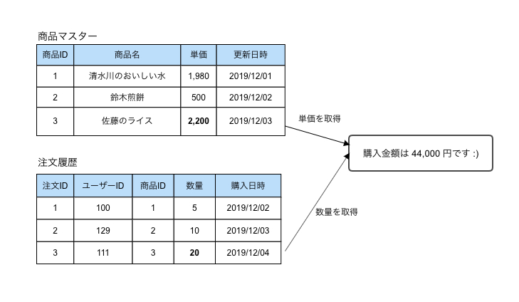
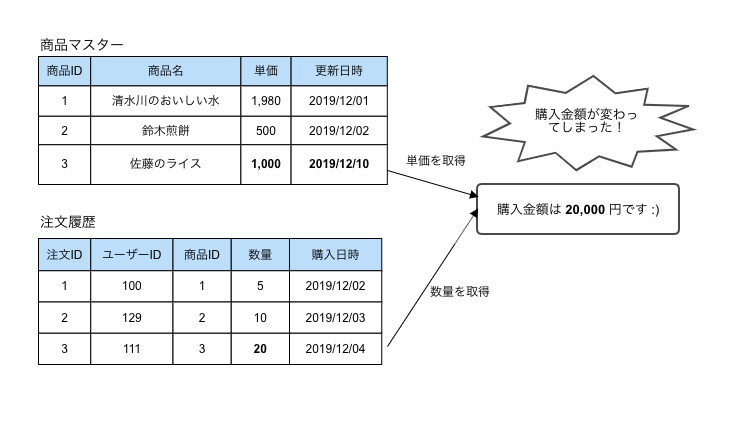

===========================================
47:トランザクションデータは正確に記録しよう
===========================================

履歴系のデータを設計したときに、システムの運用が始まってからカラムが足りないとか、当時のデータが再現できない
等のトラブルになることがあります。そのようなトラブルはどうすれば避けられるのでしょうか。

具体的な失敗
================

あるECサイトでユーザーの商品と注文履歴を以下のように管理していました。

  商品マスターと注文履歴

このサイトでは購入金額を注文履歴で閲覧できるようにするために、都度計算して表示していました。

:: 

 商品マスターの単価×注文履歴の数量＝購入金額

ところがある日「佐藤のライス」の単価を変更したら、**過去の購入履歴の金額まで変わってしまう** というトラブルが発生してしまいました。

 過去の購入金額が変動してしまう例

これは何がいけなかったのでしょうか？

商品マスターの「現在の単価」を、購入金額を計算するために必要な「購入当時の単価」として使用してしまったのが原因です。
そのため過去の事実が失われてしまったのです。

ベストプラクティス
=====================

トランザクションデータに「そのときの行為」をデータとして正確に記録しましょう。
安易に正規化して重複を排除して、必要なデータまで削ってしまわないように気をつけましょう。

今回の場合は、単純に注文履歴に購入当時の単価を追加してあげれば良さそうです。

.. omission::

関連
=======

* :doc:`46-マスターデータとトランザクションデータを分けよう`