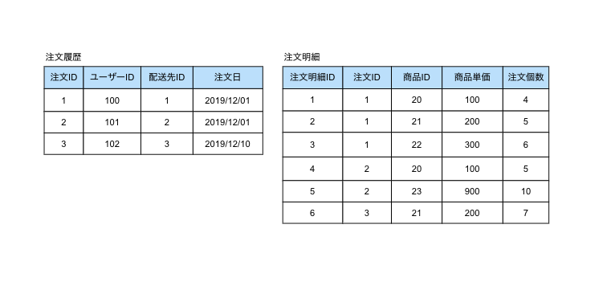

=======================================
48:クエリで使いやすいテーブル設計をする
=======================================

RDBを運用していて、大量のデータがあるテーブルにあとからカラムを追加しなければならなかったり、
無駄に複雑なクエリが必要になったりして困ったことはありませんか？

具体的な失敗
================

以下のような注文履歴テーブルと注文明細テーブルがあるとします。2つのテーブルは良く正規化されています。
たとえば、注文履歴では購入金額のカラムは持っていません。注文明細では注文日のカラムを持っていません。

   注文履歴テーブルと注文明細テーブル

このときに以下のような条件でデータを検索するよう依頼されたとします。

1. 注文日毎の売上がいくらか表示したい
2. 特定の期間に購入された商品IDとその個数を表示したい

それぞれの要件のデータを抽出できるように下記のクエリを発行するようプログラムを開発しました。

.. omission::

当初は集計した結果がすぐに表示されることを確認していました。
しかし、時間が経ち、データ量が増えていく過程で徐々に集計に時間がかかるようになりました。

なぜ時間がかかるようになったのでしょうか？　
原因は大量のデータが入ったテーブルに対してJOINを含むSQLが頻繁に実行されたことです。

ベストプラクティス
=====================

クエリで使いやすいテーブル設計をしましょう。RDB でテーブル設計するときは往々にして正規化をします。
しかし、正規化だけに着目してテーブル分割を進めると、パフォーマンスの劣化を伴うことがあります。
ほしい結果を得るために、たくさんのテーブルをJOIN して無駄に複雑なクエリを作り出してしまうからです。

具体的な失敗では、機能的な要件を満たしていましたが将来的なデータ量を考慮した性能の要件は満たせていませんでした。

JOINによるテーブルの結合は、対象となるテーブルのデータ量が大きくなればなるほど、性能が劣化していきます。
同様の結果を得つつ、性能を改善するためには、あえて正規化を崩して冗長にデータを持たせます。

.. omission::
