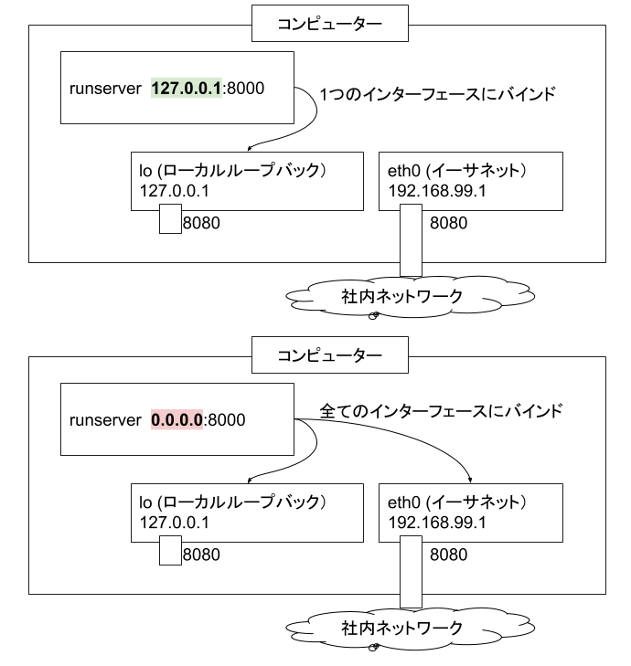

============================
105:127.0.0.1と0.0.0.0の違い
============================

.. column:: アドレスは合っているのに接続できない

    * 後輩W：開発サーバーでDjangoを起動したんですが、ブラウザでアクセスできなくて……。
    * 先輩T：お、ブラウザでアクセスしようとしてるURLは何？
    * 後輩W： ``http://192.168.99.1:8000/`` です。
    * 先輩T：（ ``http://localhost:8000/`` にアクセスしようとしたわけではないんだな）じゃあ、開発サーバーでDjangoを起動したときのコマンドとそのあと表示された内容教えてもらえる？
    * 後輩W：こうです。

      .. code:: bash

          (venv) $ python manage.py runserver
          Performing system checks...

          System check identified no issues (0 silenced).
          April 11, 2019 - 14:03:30
          Django version 2.2, using settings 'testproj.settings'
          Starting development server at http://127.0.0.1:8000/
          Quit the server with CONTROL-C.

    * 先輩T：あー、なるほど。その起動方法だと、そのDjangoサーバーは、実行している開発サーバー内からしかアクセスできない状態になっているね。 ``python manage.py runserver 0.0.0.0:8000`` で起動してみて。
    * 後輩W：こうなりました。

      .. code:: bash

          (venv) $ python manage.py runserver 0.0.0.0:8000
          Performing system checks...

          System check identified no issues (0 silenced).
          April 11, 2019 - 14:07:53
          Django version 2.2, using settings 'testproj.settings'
          Starting development server at http://0.0.0.0:8000/
          Quit the server with CONTROL-C.

    * 先輩T： ``http://192.168.99.1:8000/`` にアクセスするとどうなる？
    * 後輩W：できました！　でも ``0.0.0.0`` って何ですか？

.. omission::

ベストプラクティス
==================

サービスを提供したいIPアドレスにバインドしましょう。

:index:`開発サーバー` や :index:`仮想マシン` など、 :index:`ローカル開発環境` 以外で起動したWebサーバーにアクセスする場合は、どのネットワークインターフェースに :index:`バインド` するか指定が必要です。
コンピューター外と直接通信するには、コンピューター外との通信用ネットワークインターフェースのIPにバインドして起動します（【例】 ``python manage.py runserver 192.168.99.1:8000`` ）。
``0.0.0.0`` にバインドすることですべてのネットワークインターフェースと接続できます。

   バインド127.0.0.1と0.0.0.0の違い

.. omission::
