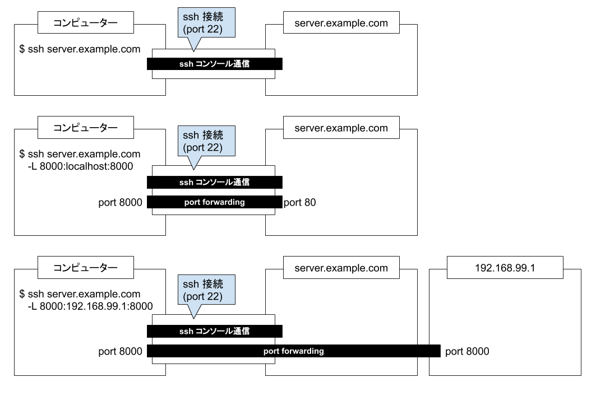

=====================================================
106:ssh port forwardingによるリモートサーバーアクセス
=====================================================

.. column:: インフラ迷子

    * 後輩W：開発サーバーでDjangoを起動したんですが、ブラウザでアクセスできなくて……。
    * 先輩T：お、以前もそんなこと言ってなかったっけ？（  :doc:`../ネットワーク/105-127.0.0.1と0.0.0.0の違い`  ）
    * 後輩W：はい、 ``http://192.168.99.1:8000/`` でアクセスできるようになったんですが、今日は社外からアクセスができなくて……。
    * 先輩T：あー、社外。 ``http://192.168.99.1:8000/`` は社内のアドレスだから、社外からはつながらないですね。
    * 後輩W：Tさんは社外からいつもどうやってつないでるんですか？
    * 先輩T： :index:`ssh port forwarding` を使ってるよ。開発サーバーにssh接続はできてるよね？
    * 後輩W：はい、それはできてます。
    * 先輩T：じゃあそのssh接続のときのコマンドに ``-L 8000:localhost:8000`` っていうオプションを付けてssh接続してみて。
    * 後輩W：しました。
    * 先輩T： ``http://localhost:8000/`` にアクセスするとどうなる？。
    * 後輩W：できました！

ベストプラクティス
==================

**ssh port forwarding** は、ssh接続を利用して、外部のネットワークから直接通信できないポートへの接続を可能にする技術です。
対象のサーバーと直接http通信できない場合であっても、そのサーバーにssh接続できるのであれば、ssh port forwardingで任意のポートと通信できます。

以下のコマンドは、ssh port forwardを行っている例です。

.. code:: shell

   $ ssh server.example.com -L 8000:localhost:80

このコマンドでのsshの接続先は ``server.example.com`` です。
接続元PCのポート ``8000`` を接続先の ``server.example.com`` から見て ``localhost:80`` に接続するようにトンネルを作成します。

   ssh port forwardingのイメージ

.. omission::

関連
==========

* :doc:`110-hostsファイルを変更してドメイン登録と異なるIPアドレスにアクセスする`