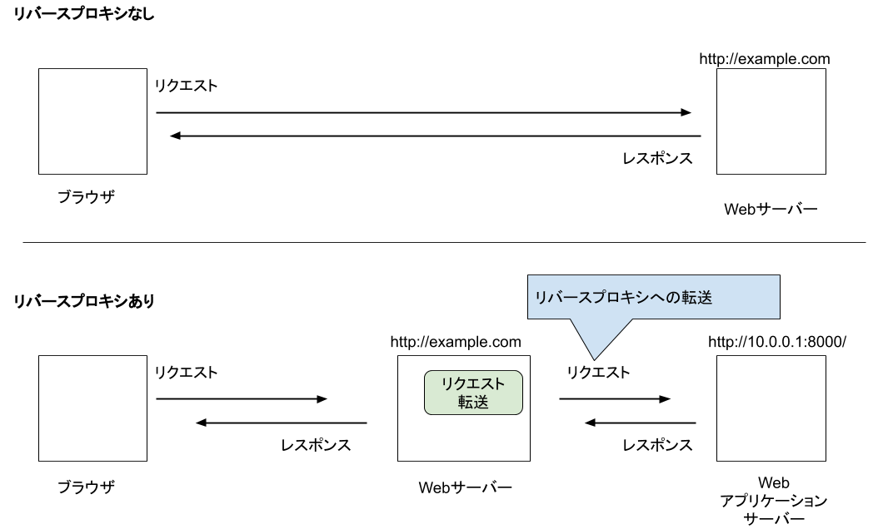

====================
107:リバースプロキシ
====================

.. maigo:: Webアプリケーション開発は覚えることが多い

    * 後輩W：Djangoを :index:`Gunicorn` で起動してるんですが、ページの表示が重い気がするんです。アクセスがちょっと増えただけでサーバーの負荷もけっこう高くなってしまうし……。サーバースペック上げたほうが良いんでしょうか？
    * 先輩T：どれどれ……あれ、Gunicornを直接ネットに公開してるの？　これだと静的ファイルも全部Djangoで処理するから、CPUとメモリにかなり負荷がかかるね。Webサーバーを立てて :index:`リバースプロキシ` するべきだよ。
    * 後輩W：リバースプロキシ……?って何ですか？
    * 先輩T：Webサーバーで受け取ったリクエストをバックエンドのGunicornに渡すやつがリバースプロキシだよ。セキュリティーの観点からも、フロントのWebサーバーを立てよう。

Webアプリケーションサーバー（Gunicorn＋Django）を直接ネットに公開した場合、すべてのHTTPリクエストをGunicorn＋Djangoで処理して返すことになります。
この構成の場合、Djangoはリクエストされた画面だけでなく、その画面を表示するのに必要なCSSやJavaScript、画像など、動的に処理する必要がない静的ファイルについてもファイル1つ毎にリクエストを受けて、返します。
リクエストを受けたページで、CSSファイルを5個、JavaScriptファイルを5個、画像を5個、利用している場合、ブラウザからはページ本体以外に15回のリクエストが送られます。
こういった静的ファイルのリクエストをすべてPython等のプログラムで処理すると、どうしても時間がかかってしまいます。

また、インターネットではWebサイトに対してロングポーリング [#longpolling]_ や巨大なリクエストを送りつける [#httpflood]_ といった多種多様な攻撃が日々繰り返されています。
こういった攻撃に対抗する仕組みはGunicornやDjangoでは提供されていません。

.. [#longpolling] リクエストデータを1秒に1文字といった低速でサーバーに送信するリクエストを複数同時に行い、サーバー側の同時接続数を溢れさせ、他の利用者がサービスを利用できなくする攻撃。
.. [#httpflood] 数百MB、数GBといった巨大なリクエストをサーバーに送信することで、サーバーのメモリを溢れさせる攻撃

ベストプラクティス
==================

:index:`Webサーバー` として :index:`Apache` や :index:`Nginx` などを設置し、 :index:`Webアプリケーションサーバー` にリバースプロキシで接続しまししょう。

   リバースプロキシ

.. omission::

関連
========

* :doc:`../プロセス設計/93-サービスマネージャーでプロセスを管理する`