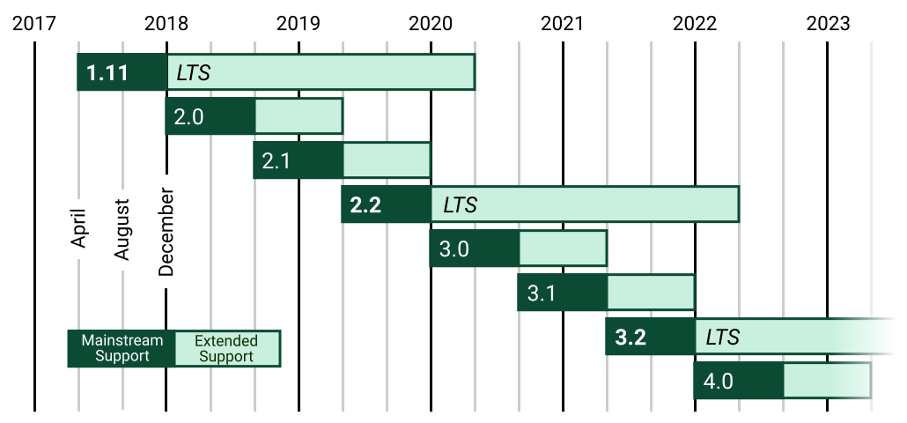

=============================
97:バージョンをいつ上げるのか
=============================

Pythonのライブラリをインストールして利用する場合、バージョンを固定するのが一般的です。
バージョンを固定するのは、意図しないタイミングで新しいバージョンのライブラリがインストールされ、APIの変更などでプログラムが動作しなくなるトラブルを避けるためです。
しかし、バージョンを固定したままでは、今度はセキュリティー上の問題を放置してしまうことになります。

では、いつバージョンを上げれば良いのでしょうか？　
いつまでも古いバージョンを使い続けると、バージョンアップによる機能やAPIの変化が大きくなり、バージョンアップによる修正とテストのコストが増大していきます。
コストが増大した結果、バージョンアップを諦めざるを得ないプロジェクトもありそうです。

.. index:: LTS

しかし、セキュリティー上の重大な問題が発生した場合、新しいバージョンには修正版が提供されても、古いバージョンは修正されないことがほとんどです。
たとえば、Django1.8は2018年3月末でセキュリティー更新が終了しました。
Django1.8を使い続けているプロジェクトでは、最低でも1.11にバージョンを上げる必要があります。
その1.11も2020年4月で更新が終了するため、セキュリティー更新のあるバージョンを使っていくためには次のLTS（Long Term Support）である2.2に上げる必要があります。
こういった大ジャンプを避けるためにも、定期的にバージョンアップしましょう。

   Djangoリリースロードマップ（公式サイトより）

ベストプラクティス
====================

利用しているライブラリのバージョンを上げるタイミングについて、いくつかの観点に分けて説明します。

**フレームワーク**

DjangoやCeleryといった機能や影響が大きいフレームワークの場合、パッチバージョン（2.2.8→2.2.9） [#semver]_ の適用はこまめに行いましょう。

.. [#semver] https://semver.org/lang/ja/

.. omission::

**フレームワーク以外のライブラリ**

1年に1回など、定期的にバージョンを更新していくのが良いでしょう。

.. omission::

**開発用のツール**

flake8、mypy、pytest、toxといった開発中だけ使用するライブラリは、極端なことを言えばバージョンを上げる必要はありません。
半年以上継続する開発プロジェクトであれば、他のライブラリの更新時に合わせてバージョンアップする戦略が良いでしょう。

.. omission::

