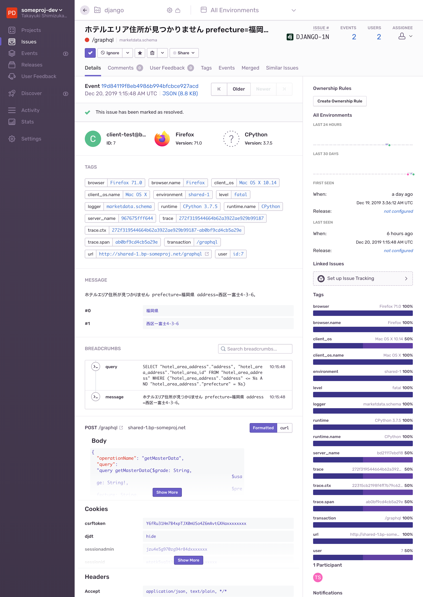

=====================================
75:Sentryでエラーログを通知／監視する
=====================================

ログを収集したものの、大量のログから必要な情報を見つけられない、といったことはありませんか？　

あるいは、ログにERRORが記録されたときに通知するように設定したために、大量の通知でメールボックスが埋め尽くされたことはありませんか？　
Djangoにはエラー発生時に管理者にメール通知を行う機能がありますが、メールを送信しないシステムの場合は通知のためにメールサーバーを用意する必要があります。
また、このエラー通知メールはエラー発生ごとに毎回送信されてしまうため、1,000件のメールの中に非常に重要なエラー通知が1件紛れ込んだ場合に、その1通を見逃してしまうことがあります。

ベストプラクティス
========================

.. index:: ログ
.. index:: エラートラッキングサービス

エラートラッキングサービスを使いましょう。

:index:`Sentry` [#Sentry]_ を利用すれば、連続する同じエラーをまとめて1回だけ通知してくれるため、障害が発生したときに必要な情報に素早く到達できます。
また、Sentryサービスにはログだけでなく、エラー発生回数や頻度、ユーザーのブラウザ情報、ブラウザからPOSTされたデータ、発行されたSQLなど、多くの情報が通知されます。
こういった情報をSentryサービス上で参照できるため、状況を素早く把握でき、問題の切り分けがスムーズに進みます。
特に、DBトランザクションを使用しているシステムでは、エラーでデータがロールバックされてしまうとデータベースやログにデータの状態が残らないため問題追跡が難しくなってしまいますが、Sentryを使用していれば、POSTデータと発行したSQLの記録から状況を再現することも可能です。

.. [#Sentry] https://sentry.io/

   Sentryの通知画面例

.. omission::

関連
===========

* :doc:`69-ログメッセージをフォーマットしてロガーに渡さない`
* :doc:`71-info、errorだけでなくログレベルを使い分ける`
* :doc:`72-ログにはprintでなくloggerを使う`

