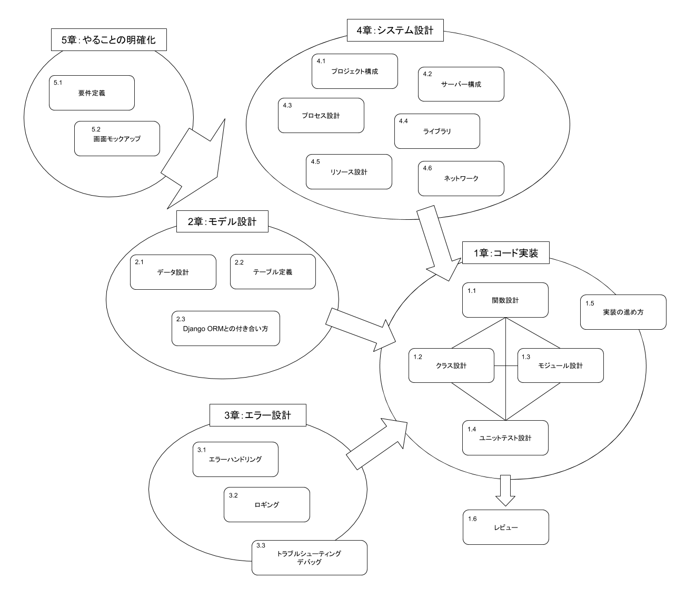

======
前書き
======

プログラミング「迷子」になったことはありませんか？　プログラミング迷子には次のような特徴があります。

- 特徴1: 何から手を付けて良いのかわからない
- 特徴2: 正しい方向に進んでいるか自信がもてなくて考え込んでしまう
- 特徴3: どのファイルに何のコードを書くか定まらず、気がつくと一貫性がなくなっている
- 特徴4: ミドルウェアや外部ライブラリをどう選んだら良いかわからないし、質問もできない
- 特徴5: 検索で見つけたコードを貼ってみたけど、なぜかうまく動かない
- 特徴6: テストコードを書くのにものすごい時間がかかった割に、肝心なところがバグだらけ
- 特徴7: バグをなおそうとして、別のバグを生んでしまった
- 特徴8: 完璧に仕上げようと時間をかけたのに、レビューしてもらったら見当違いだと指摘された
- 特徴9: 作ってみたは良いけど、ごちゃごちゃしていて今後も開発を続けるのが大変
- 特徴10: ログを出しているのは知ってるが、役に立ったことはない

自分1人で走れないのは、進む方向がわからないからです。つまり「地図」を持っていないからです。
本書はプログラミング迷子に向けて、絶対に知ってほしい「ソフトウェア開発の地図」を伝えるものです。
さあ、地図の作り方を身につけて、「自走プログラマー」になりましょう！

本書の構成と読み進め方
======================

本書は、「プログラミング入門者が中級者にランクアップ」するのに必要な知識をお伝えする本です。
扱っている120のトピックは、実際の現場で起こった問題とその解決方法を元に執筆しています。
このため、扱っているプロジェクトの規模や、失敗パターンのレベル感もさまざまです。
各トピックでは具体的な失敗とベストプラクティス、なぜそれがベストなのかを解説します。

本書は、プログラミング言語Pythonを使って設計や開発プロセスのベストプラクティスを紹介します。
Pythonにくわしくない方でも、プログラミング言語の文法を知っている方であれば理解できるようにしています。
逆に、プログラミング自体が何かわからない人のための本ではありません。
すでにプログラミング言語の文法や書き方、役割を知っている人が、より効率的かつ効果的にプログラムを書く、価値を創る方法をお伝えする本です。

本書は、大きく5つの章に分かれています。

   本書で扱っているトピックの地図

1章「コード実装」では、コードを書く話を扱っています。
プログラマーがもっとも興味のある部分かもしれません。
関数設計、クラス設計、モジュール設計、ユニットテストの実装、そしてGitHubのPR（Pull Request）を使ったレビューの進め方について、具体的なプラクティスを紹介します。
また、「迷わない実装の進め方」を実現するソフトウェア開発の地図「開発アーキテクチャドキュメント」の作り方について説明します。

2章「モデル設計」では、アプリケーション開発で必ず必要になるデータの扱いについて具体的なプラクティスを紹介します。
テーブル定義やデータの扱い方は、開発速度を左右する重要な知識です。
また、ORM（Object-Relational-Mapping）との良い付き合い方についても紹介します。

3章「エラー設計」では、プロダクション環境へのリリース後に必要となる技術について紹介します。
エラーが発生する処理をどのように実装するべきか、ログ出力は何のためにどんな内容にするべきかといったプラクティスを紹介します。
また、トラブルシューティングとデバッグについても紹介します。

4章「システム設計」では、プロジェクト全体のシステム構成を組み立てていきます。
Python環境の選び方、サーバー構成、プロセス、ライブラリ、リソース、ネットワークといった、プログラムを実際に動作させるのに必要となる環境に焦点をあてています。

5章「やることの明確化」は、コードを書く前の話です。
これから作ろうとしているモノがどのような特徴を持っていて、どのように使われるのか明確にしていきます。
何を作ろうとしているのかをあいまいなまま進めてしまうと、実装中やレビューの段階で大前提からやり直しになってしまいます。
どのくらい「明確化」に時間をかければ手戻りをおさえつつ、次の段階に進めるのかを解説します。

本書は、章が進むにつれて「プログラム」から「周辺の技術」に話題が移っていきます。
各トピックは独立しているため、どこから読み始めてもかまいません。

* コードに関する要素から読みたい人は、1章から読んでいくと良いでしょう。
* そもそも何を作るかを明確にしてから進めたい人は、5章から1章に向けて読むと良いでしょう。

対象読者
========

- チョットした便利なコードを書けるけど、中〜大規模のシステムを上手に作れない人
- プログラムを書けるけど、レビュー指摘などで手戻りが多い人
- 優れたエンジニアになりたい人
- PythonでWebアプリケーションの開発をするときの指針が欲しい人
- Python入門を果たしたプログラマーで、仕事でPythonをやっていこうという人
- 設計の仕方や、メンテナンス性の高いプログラムの書き方を知りたい人
- ライブラリの選定を、確信を持ってできるようになりたい人

プログラミングブームにおける本書の価値
======================================

プログラミングは、パソコンがあれば無料で始められます。初学者向けの本もたくさんあり、特にここ数年は今まで以上に多くの人がプログラミングを始めています。
裾野はどんどん広がっていき、2020年からの初等教育でのプログラミングの必修化もそれを後押ししていくでしょう。
あと何年か後には、プログラミングが今よりももっと日常的に行われる世の中になっているかもしれません。

こうした状況はとても喜ばしいことですが、プログラミングが一部の人のだけが持つスキルでなくなれば、仕事でプログラミングする人にはより高いスキルが求められることになります。
競争が激しくなっていくなかで、より秀でたプログラマーになるためには、何が求められるでしょうか？

プログラミングで何かを作るには、文法の他にアプリケーションを設計するスキルや、ライブラリを選定するスキル、Webアプリケーションなら本運用し続ける環境を整えるスキル、運用するスキル、などさまざまなスキルが必要です。
これらのスキルのうち、「プログラミングで何かを作るプロセスとスキル」「プログラミングで作りたいものを設計するスキル」をお伝えするのが本書です。
本書を読み終わったとき、次のようになれたらすばらしいと思いませんか？

- 自分の作りたいものを着実に作るプロセスがわかっている
- どう設計すればアプリケーションとして良いものができるかがわかっている
- どういう場合にどのライブラリを使えば良いかわかっている

本書はそんな、単にプログラミング言語だけでないプログラミングの「中級な」「設計を含んだ」「うまく作るための」内容をお伝えする本です。
少し読んでみると「プログラミングそのものの話題が少ない」と少し戸惑うかもしれません。
ですがそれこそがプログラミング能力を活かして何かを作るために必要なことです。

著者の思い
==========

我々ビープラウドは、在籍するスタッフの多くがコードを扱います。
代表取締役も、営業の役割を担っている人間も、コードを読み書きします。
現在の仕事は多くが受託開発で、大量のトラフィックを捌く必要があるコンシューマ向けのWebシステムや、ビジネス向けのWeb業務システム、機械学習によるデータ処理とWebの連携などが多くを占めているWeb系ソフトウェア開発という職種です。

ビープラウドでの開発プロジェクトは2-3ヶ月という短いスパンのプロジェクトを2-3名で開発することが多いため、1人が関わる範囲が広く、必然的に書くコードの量も多くなります。
私たちにとってプログラマーとは、設計書をコードにする単純作業者のことではなく、やりたいことをまとめ、設計からコードにし、そしてリリースするまでをすべて1人でできる人のことを指しています。
本当にすばらしいサービスやアプリケーションをつくり出すには、自走できるプログラマーが必要です。

とはいえ、すべてのプログラマーがはじめから自走できたわけではなく、組織のメンバは常に入れ替わっていき、新しく参加するメンバの中にはこれからいろいろなことを学んでいく人もいます。
それは、技術的なつまづきと学びを繰り返して、その背景にある原理原則をメンバそれぞれが見つけていく、長い旅のようなものです。
ビープラウドには、この学びの旅をサポートする「教え合う文化」が根付いており、つまづいたときには先輩が親身になって助けてくれます。
そこで先輩達が教えてきた履歴をみると、新しいメンバーがなぜか必ずつまづいてしまうパターンがいくつもあることがわかってきました。
こういった、設計からコードまで書けるようになるために知っておいて欲しい技術的なトピックを集め、この本にまとめました。

本書は、プログラミング入門ならぬ、脱入門者を目指す開発者向けの指南書です。
自走できるプログラマーであれば知っているであろういろいろな手法や観点を元に、「プロジェクトの各段階でプログラマーがやること」「その選択をどう判断するのか」「どうコードを実装して実現していくのか」を紹介します。
一部の最新技術に注目するのではなく、実際のプロジェクトに適用して、プロジェクトを完成させるための指針をまとめました。

