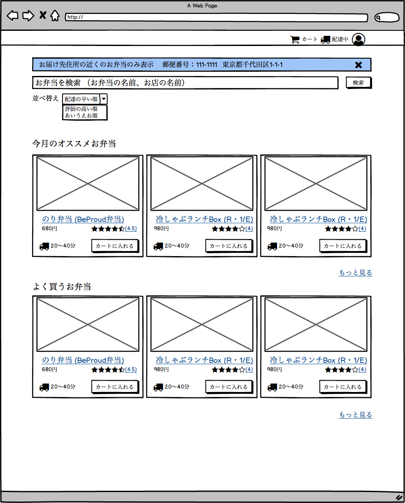

========================================
114:文字だけで伝えず、画像や画面で伝える
========================================

画面の仕様を決める（要件定義をする）ときに、「仕様を文章で書いたは良いが他の人に伝わらない」ということがよくあります。
どうすればより他の人に伝えやすい要件定義ができるでしょうか。

具体的な失敗
=============

* 画面の仕様を箇条書きで書いたが認識の違いが生まれた
* チームメンバーに共有したときはOKをもらったが画面を作ったときにNGが出た

  * 共有した段階ではどんな画面になるかのイメージが伝わっていなかった
  * 文字情報だけでは目が滑ってしまって深く読んでいる人がいなかった

自分1人で作っているとしても、仕様が明確になっていないと作っている間に迷走してしまいます。

ベストプラクティス
==================

文字だけで伝えず、画像で伝えるようにしましょう。

文字で伝えられる情報には限界があります。画像を見れば頭の中のイメージが活性化して、チーム内での議論も活発化します。

.. omission::

以下のような白黒を基本とした絵がモックアップです。細かい文言は書かなくて良いので、各画面に必要な要素、おおまかな配置や遷移に注目して描きます。

   モックアップ：お弁当一覧画面

絵を描くには紙にペンで描いても良いですし、 `BalsamiqMockup <https://balsamiq.com/wireframes/>`_ のようなツールを使っても良いです。
上記の例では :index:`BalsamiqMokup` を使っています。

.. omission::
