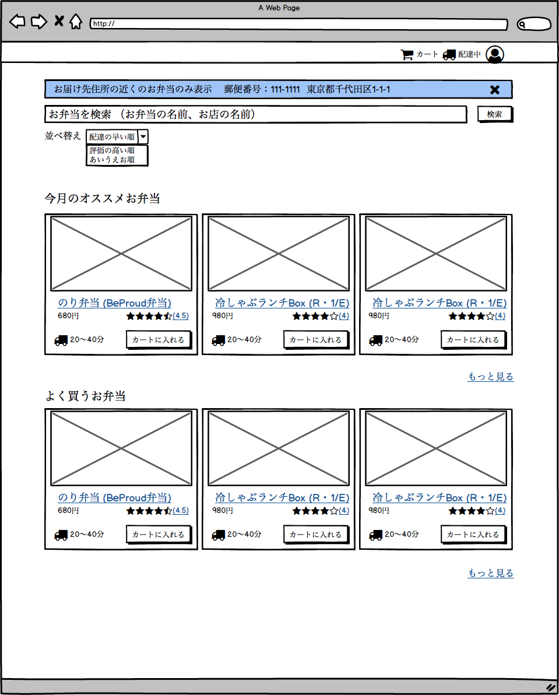

============================================
118:モックアップから実装までをイメージしよう
============================================

モックアップは描き出すだけでなく、読むプロセスも大切です。
特に頭を使わずに「見た目にもよさそう」と判断していませんか？　
モックアップを見るときに、システム構成や実装するプログラムをイメージできていますか？　
たとえば、モックアップを「何となく良さそう」とレビューしてしまうのは要注意です。

ベストプラクティス
==================

モックアップから具体的な実装をイメージしましょう。

実装をイメージできないときは、具体的に仕様を確認しましょう。
モックアップと仕様を確認して、できる限り実装をイメージすることで事前に実装が難しい（工数がかかる、複雑になる）箇所を把握しておくのがポイントです。

モックアップは表示する情報や使い心地を検討するだけでなく、仕様書としての意味合いがとても強いです。
このような観点を持つことで、画面モックアップは「単なる画面の下書き」でなく、未来に必要な仕様や設計の青写真と捉えられます。

* どのようなデータ（テーブル、モデル）が必要か
* 各画面を表示するために、どうデータを取得する必要があるか
* キャッシュや集計する処理が必要か

ECサイトのトップページから、後々に必要になるモデル、ミドルウェアや集計処理を読み解きましょう。

   モックアップから実装をイメージする

.. omission::
